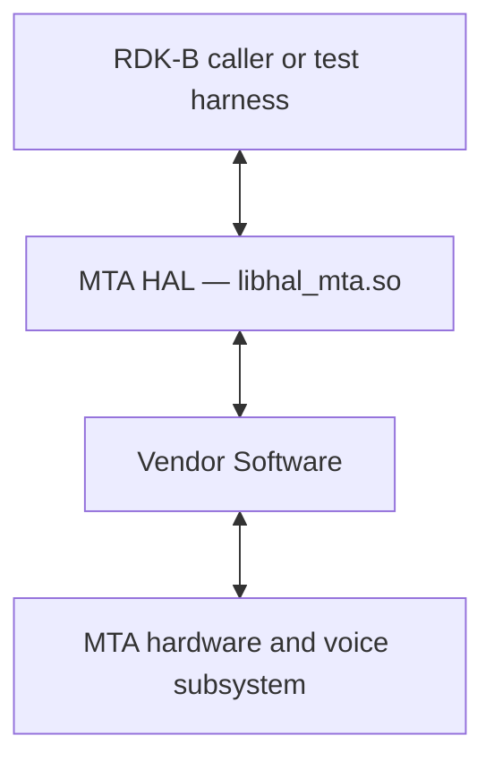
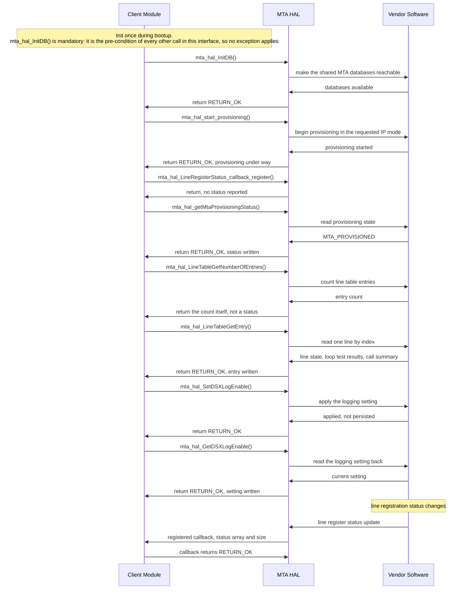

# MTA HAL Documentation

## Version History

| Date | Comment | Version |
| --- | --- | --- |
| 2024-01-29 | `RDKB-52497` — initial release of the MTA HAL interface definition, migrated to GitHub. | 1.0.0 |
| 2024-02-02 | `BD-1247` — `build_ut.sh` corrected. No interface change. | 1.0.1 |
| 2024-02-07 | Interface correction release: missing semicolon on the `MTAMGMT_MTA_CALLS` structure in `mta_hal.h`, plus a further header update. | 1.1.0 |
| 2026-08-24 | Rewritten against the canonical `HAL` specification topic set. Page renamed from `MTAhalSpec.md` to [halSpec.md](halSpec.md). Added `Version History`, `Optional Components`, `Data Structures and Defines`, `API Surface` and `State Diagram`; every one of the 49 declared functions is now named; the asynchronous notification callback is documented for the first time, correcting the previous claim that this interface has none; the sequence diagram now uses declared identifiers only. | 1.1.1 |

Four version identities apply to this repository. They are kept apart deliberately, because a caller
needs a different one in each case and conflating them gives a false impression of how the interface
is versioned.

| Identity | Value | What it is |
| --- | --- | --- |
| Document revision | `1.1.1` | The revision of this specification, as recorded in the table above. |
| Interface version | Not declared | `mta_hal.h` defines **no** interface version macro. There is no MTA equivalent of the major, minor and maintenance macros some other RDK-B HALs publish, and no function reports an interface revision. A caller therefore has **neither a compile-time nor a run-time check** of which revision of this header a platform was built against; see `Variability Management`. |
| Release tag | `1.1.0` | The nearest ancestor tag of the revision this document describes, and the latest tag in the repository. Tags carry no `v` prefix. The changelog section for `1.1.0` is undated, so the date in the table above is the tag's own date rather than a changelog entry. |
| Generated-site version string | A string of the form `<tag>-<commits-since-tag>-g<abbreviated-hash>` | `docs/generate_docs.sh`:26 derives `PROJECT_VERSION` from `git describe --tags` and passes it to the documentation generator. When the working revision is not itself tagged, that output is a build identifier naming a tag plus the commits after it — **not** a released version, and it must not be read as one. No fixed value is quoted here, because it changes with every commit. |

**Provenance of this page.** It was renamed from `docs/pages/MTAhalSpec.md` to the canonical [halSpec.md](halSpec.md) in the same change that rewrote it against the canonical topic set. Git records a rename only where the two versions still resemble each other, and a full rewrite does not, so `git log --follow -- ./docs/pages/halSpec.md` begins at that change: the revisions before it are reached with `git log -- docs/pages/MTAhalSpec.md`. That resemblance is measured, and the threshold is 50% by default, so lowering it to git's floor \- `git log --follow -M1% -- ./docs/pages/halSpec.md` \- is worth trying first: where it pairs the two paths it shows both stretches of history in one listing, and where the rewrite kept too little of the original for git to pair them at any threshold the second command above remains the only route to the earlier revisions.

*Derived from the repository's changelog (its three release sections; the `1.1.0` section
carries no date, so that row's date is the tag's own), the repository's git tags,
`docs/generate_docs.sh`:23-30, and
`include/mta_hal.h`, which declares no version macro.*

## Acronyms

- `API` \- Application Programming Interface
- `DECT` \- Digital Enhanced Cordless Telecommunications
- `DHCP` \- Dynamic Host Configuration Protocol
- `DHCPv6` \- Dynamic Host Configuration Protocol for IPv6
- `DOCSIS` \- Data Over Cable Service Interface Specification
- `DSX` \- Digital Signal Cross-connect
- `GR909` \- Telcordia GR-909 loop diagnostic test suite
- `HAL` \- Hardware Abstraction Layer
- `MTA` \- Media Terminal Adapter
- `OEM` \- Original Equipment Manufacturer
- `PIN` \- Personal Identification Number
- `QoS` \- Quality of Service
- `RDK-B` \- Reference Design Kit for Broadband Devices
- `SLA` \- Service Level Agreement
- `TN` \- Telephone Number

<em>Bounded to the terms this document uses. `TN` is the spelling the interface itself uses, in the
`OperatingTN` and `SupportedTN` members of `MTAMGMT_MTA_HANDSETS_INFO`
(`include/mta_hal.h`:222-223); `GR909` and `DOCSIS` come from the briefs
of `mta_hal_TriggerDiagnostics` (:809) and `mta_hal_GetServiceFlow` (:853).</em>

## Description

The diagram below describes the high-level software architecture in which this interface sits.

The MTA HAL is the abstraction layer through which RDK-B drives a Media Terminal Adapter — the part
of a broadband device that delivers home phone service over `DOCSIS` alongside high-speed internet.
It abstracts the underlying MTA hardware and the vendor voice software behind one standard set of
functions, so that a caller works against a fixed contract rather than against a particular vendor's
implementation.

This repository carries the **interface definition only**.
`include/mta_hal.h` declares 49 functions, the data types they exchange
and the status values they report; each vendor or `OEM` ships its own implementation behind that
contract as a shared library. Nothing in this repository implements the interface, and nothing in it
builds.

**No dedicated middleware service is named for this interface.** Most RDK-B HALs are owned by a
running middleware service that must be stopped before the HAL is exercised directly; the
superproject's service-dependency inventory records **none** for MTA, and lists no service to stop
for it. A caller of this interface is therefore whichever RDK-B component or test harness links the
library directly, and it is that caller — not a middleware owner — which is responsible for the
initialization order described under `Initialization and Startup`.

For a caller, the interface covers seven things:

- **Initialization and provisioning** — make the shared MTA databases available locally, start IP
  provisioning for the voice lines in `IPv4`, `IPv6` or dual-stack mode, and read how far
  provisioning, the configuration file and `DHCP` have progressed.
- **Lines, telephone numbers and registration status** — how many entries the line table holds, the
  state and loop-test results of a single line, per-line registration status by poll or by callback,
  and the line reset count.
- `DECT` handsets — enable the cordless subsystem, open and close the registration window,
  deregister a handset, read the base station's identity and versions, get and set its
  authentication `PIN`, and enumerate the registered handsets.
- **Calls and call processing** — the per-call voice-quality records held against a line, the
  call-processing and line-card state of a line, the `DOCSIS` service flows in use with their `QoS`
  parameters, and discarding the records for a line.
- `DSX` **and call-signalling logs** — read, enable, disable and clear the `DSX` and call-signalling
  logs, and read the MTA event log in full.
- **Battery** — whether a backup battery is fitted, its design and present capacity, remaining
  charge and run time, cycle rating, power source, condition, present activity, replacement verdict,
  identity and power-saving mode.
- **Diagnostics and device maintenance** — start the `GR909` loop-condition tests on a line, reset
  the device, and read the MTA reset count.

**How to read this document.** `Description` and `Component Runtime Execution Requirements` answer
"what is this and how do I call it". `Non functional requirements` and `Interface API Documentation`
answer the protocol-level questions — exact identifiers, data structures, call ordering, return-code
semantics and what the status enumerations do and do not promise. `API Surface` is the boundary
between the two: a reader who came for the overview can stop above it.

**On the architecture raster this repository carries.** `docs/pages/images/mta_hal_architecture.png`
is not referenced by this document. It depicts an RDK-B stack component, `CcspMTAAgent`, as the
owner of this interface; no declaration in `mta_hal.h`, no file in this repository and no entry in
the superproject inventory establishes that component, and the inventory positively records no
owning service for MTA. The reference was therefore dropped rather than carried forward against the
evidence, and the flowchart above stands alone. The file itself is left in place unchanged.

*Derived from `include/mta_hal.h` — the declaration set at :647-2634 and the interface overview at
:22 — from the delivered library named under `Build Requirements`, and from the RDK-B HAL
superproject inventory that carries this repository as a submodule, whose MTA entry (at line 50 of
the superproject README) states the subject matter the header corroborates and whose
service-dependency table (:100) records no service to stop for MTA. The architecture claim is the
flowchart's alone; the superproject is context, and where it and the header could disagree the
header governs.*

## Optional Components

Two parts of this interface are optional in the sense that a deployment may not have the hardware
behind them. Everything else is not optional.

- **The backup battery, and the twelve calls that read it.** `mta_hal_BatteryGetInstalled`
  (`include/mta_hal.h`:1662) exists precisely so that a caller can
  establish whether a battery is fitted before interpreting anything else the battery calls report.
  The header states that the battery calls do **not** distinguish an absent battery from any other
  failure, so `mta_hal_BatteryGetInstalled` is the presence test and a failed capacity or status
  read is not (:585-589).
- **The `DECT` cordless subsystem, and the nine calls that drive it.** It is switchable at run time
  through `mta_hal_DectGetEnable` (:922) and `mta_hal_DectSetEnable` (:955), and a deployment with
  the subsystem disabled or absent exercises none of the remaining `DECT` calls. `DECT_MAX_HANDSETS`
  (:176) fixes the largest handset population at 5, so a caller sizes for that and no more.

No other part of the interface is conditional: this repository declares no build-time feature flag
that removes a declaration, no optional external daemon and no substitutable library. See `Platform
or Product Customization`.

*Derived from `include/mta_hal.h`:176, :585-589, :922, :955 and :1662.*

## Component Runtime Execution Requirements

The requirements in this block apply to every implementation of this interface. A caller relies on
them, so an implementation that does not meet them will produce undefined behaviour in the calling
component.

### Initialization and Startup

**This interface has an initialization sequence and no teardown.** Two calls bring it into use, in
this order, and a caller makes both once during bootup before it relies on any other entry point:

- `mta_hal_InitDB()` \- retrieves the global information for all shared databases and makes them
  accessible locally. It takes no argument and reports nothing but its status. It is the
  pre-condition of every other call in the interface, and has none of its own.
- `mta_hal_start_provisioning()` \- starts IP provisioning for all voice lines in the address mode
  the caller selects, carrying the `DHCP` option 122 and option 2171 values the implementation is to
  use. A `RETURN_OK` from it means provisioning is **under way**, not that the lines are
  provisioned.

Provisioning progress is then read, not awaited: `mta_hal_getMtaProvisioningStatus()`,
`mta_hal_getConfigFileStatus()` and `mta_hal_getDhcpStatus()` report how far it has got, and
`mta_hal_getMtaOperationalStatus()` reports the MTA's overall state. A caller that needs per-line
registration status either polls `mta_hal_getLineRegisterStatus()` or installs the callback
described under `Asynchronous Notification Model`.

**A caller that wants the callback registers it early.**
`mta_hal_LineRegisterStatus_callback_register()` requires `mta_hal_InitDB()` to have succeeded, and
this interface does not deliver status changes that occurred before registration, so a caller
registers before the events it cares about can occur and has everything the callback touches ready
first.

**There is no de-initialization call.** This interface declares no teardown, close or
de-initialization function of any kind, so there is nothing for a caller to release and no way to
return the implementation to its pre-initialization state; on success the shared databases stay
reachable for the lifetime of the process. A caller cannot release and re-acquire the interface
within one process, and the registered callback is bound by the same limitation — the interface
declares no way to remove one. Cleanup is left to process termination.

Third party vendors will implement appropriately to meet operational requirements. **This interface
is expected to block if the hardware is not ready** — which, at bootup, is exactly when a caller
invokes `mta_hal_InitDB()`; see `Blocking calls`.

<em>Derived from `include/mta_hal.h`:565-571 (the lifecycle statement),
:617-647 (`mta_hal_InitDB` and its pre- and post-conditions), :2469-2518
(`mta_hal_start_provisioning`), :2614-2615 (the callback's registration ordering), and the
initialization statement carried by the predecessor of this page.</em>

### Threading Model

**The interface is not thread-safe.** Any module invoking an MTA HAL function must ensure calls are
made in a thread-safe manner: a caller serialises its own calls, and must complete
`mta_hal_InitDB()` before issuing any other call from any thread.

This is a deliberate property of the MTA HAL and it differs from other RDK-B HALs, some of which
require the implementation itself to be thread safe. **A caller must not carry an assumption of
thread safety over from another HAL.**

Vendors may create internal threads and event mechanisms to meet their operational requirements.
Those mechanisms are responsible for synchronizing between calls and events, and for cleaning up
their own resources — memory, file handles and threads — on closure.

One consequence belongs to the notification callback. It is invoked by the implementation, not by
the caller, on a context this interface does not specify, so a callback body must be treated as
running concurrently with the caller's own use of the interface and must protect any state it
touches. Because the interface is not thread safe, **a callback must not call back into the MTA
HAL**: doing so would issue an unserialised call from an unspecified context. See `Asynchronous
Notification Model`.

*Derived from the threading policy stated by the predecessor of this page, retained here as this
repository's own statement, and corroborated by
`include/mta_hal.h`:596-597 and :2530-2536.*

### Process Model

All functions are expected to be called from multiple processes. Because of that concurrent access,
vendors must implement protection within their implementations against two processes calling the
same function simultaneously; this is what preserves data integrity and prevents race conditions.

The two statements above and the one under `Threading Model` combine into an obligation a caller
should read carefully: **the serialisation a caller owes this interface spans processes, not just
threads.** Each per-function block in the header states it in those terms — the caller serialises
the call against every other MTA HAL call, *including calls made from another process*. Where more
than one RDK-B component links this library, they need a serialisation arrangement between them that
this interface does not provide.

*Derived from the process model stated by the predecessor of this page, and from
`include/mta_hal.h`:596-597 and the per-function thread-safety warnings,
for example :891-892.*

### Memory Model

The client is responsible for allocating and deallocating memory for the functions that need it, as
specified in the per-function documentation. Vendors may allocate memory for their own internal
operational requirements, and are responsible for de-allocating it internally.

Per-function ownership is stated on each declaration rather than repeated here, because it is a
per-call property that this interface does not settle globally: see the `@param` and `@warning` text
in `include/mta_hal.h`.

#### Caller Responsibilities

- **Allocate every output structure before the call.** The interface declares no allocator and no
  release function, and the overwhelming majority of its functions write through a pointer the
  caller supplies — a scalar, a fixed-width buffer, or one of the structures listed under `Data
  Structures and Defines`. Such a pointer must not be NULL. **Whether the implementation keeps the
  pointer after the call is not established by this interface**, so a caller keeps each buffer under
  its own control rather than assuming it becomes private again on return — see the buffer-lifetime
  rule at the end of this list.
- **Size fixed-width buffers to the interface's own bounds.** `mta_hal_GetDectPIN()` and
  `mta_hal_SetDectPIN()` exchange the `PIN` through a `char*` whose backing buffer the caller owns;
  the four `CHAR*`-plus-length battery reads — `mta_hal_BatteryGetPowerStatus()`,
  `mta_hal_BatteryGetCondition()`, `mta_hal_BatteryGetStatus()` and `mta_hal_BatteryGetLife()` —
  take a buffer and a length in the same call, and the length argument is how the implementation
  learns the size it may write.
- **Do not free, and do not retain, memory this interface hands back.** Five functions return an
  array through a pointer-to-pointer out-parameter — `mta_hal_GetServiceFlow()`,
  `mta_hal_GetHandsets()`, `mta_hal_GetCalls()`, `mta_hal_GetDSXLogs()` and `mta_hal_GetMtaLog()` —
  and two structures carry a second level of indirection the implementation supplies: the `pCalls`
  member of `MTAMGMT_MTA_LINETABLE_INFO` and the `pDescription` member of `MTAMGMT_MTA_MTALOG_FULL`.
  **This interface does not specify which side allocates or releases any of them.** A caller must
  therefore not free them, must not assume they outlive the next MTA HAL call, and must copy
  anything it needs to keep. Freeing memory the implementation owns and leaking memory it does not
  are both consequences of guessing, so the ownership rule has to be established with the
  implementation before it is relied on.
- **The return of a call is not the moment an input buffer becomes the caller's again.** This
  interface states no lifetime for any input argument and no post-condition that releases the
  caller's storage, and that silence is **not** permission: a caller must not reuse, move, free or
  overwrite a buffer it handed in merely because the call has returned. It keeps each one stable —
  allocated, unmoved and unmodified — until it holds an explicit statement from the implementation
  it integrates that the value is copied, or that the pointer is not retained; only then may the
  buffer be reused, released or cleared. Two cases make the rule concrete. The `PIN` passed to
  `mta_hal_SetDectPIN()` is the case where the interface says nothing at all about retention, and
  the declaration now states the consequence rather than inferring a release
  (`include/mta_hal.h`:1149-1161). The structure passed to
  `mta_hal_start_provisioning()` is the case where the interface addresses the question and still
  does not settle it (:2480-2484), so the structure is kept valid at least until provisioning is
  confirmed to have progressed. Where the buffer holds a protected value, the clearing obligation
  under `Logging and debugging requirements` applies as soon as that contract permits erasure and is
  then discharged immediately: keeping the buffer stable and clearing it afterwards are sequential
  steps, not competing rules. The rule is not confined to inputs. A caller-allocated **output**
  buffer is storage the caller handed across the same boundary, and the declarations say the same
  thing about it — the buffer behind `mta_hal_GetDectPIN()` (:1105-1120) and the structure behind
  `mta_hal_GetDect()` (:1067-1073) are each kept allocated and unmodified until the caller has
  established that the pointer was not retained — so an output buffer is not overwritten on return
  either. What a caller may always clear at once is a copy it made for itself, because no
  implementation holds a pointer to that.

#### Module Responsibilities

- Allocate and de-allocate memory for internal operations, and release everything internally
  allocated on closure, so that no resource leaks.
- Write only through the pointers the caller supplied, and only as far as the bounds the caller
  stated.
- Do not retain a caller-supplied pointer after the call returns. This is an obligation on the
  implementation and not a property the interface establishes or reports: no declaration states a
  lifetime for an input argument, and the two that address the question —
  `mta_hal_start_provisioning()` at `include/mta_hal.h`:2480-2484 and
  `mta_hal_SetDectPIN()` at :1149-1161 — each record that retention beyond the call is **not**
  stated either way. A caller therefore follows the conservative guidance under `Caller
  Responsibilities` rather than relying on this rule, and an integrator that needs the lifetime
  settled establishes it with the implementation.
- Zero-terminate every string written into a caller-supplied text buffer, so that a caller can
  determine its length safely.
- Adhere to these rules unless a specific declaration in
  `include/mta_hal.h` states otherwise for its own arguments.

**No memory footprint limit is specified for this interface.** Neither this repository nor the
header states a maximum resident size, a heap budget or an allocation count for an implementation. A
caller cannot rely on a bound, and an implementer is not held to one by this specification. See
`Memory and performance requirements`.

<em>Derived from the memory model stated by the predecessor of this page, and from
`include/mta_hal.h`:600-605 (the interface-wide statement), :780-784
(`pCalls`), :885-887 (`ppCfg`), :1618-1624 (`pDescription`), :1149-1161 (the `pPINString` lifetime
statement) and :2447-2458 (the provisioning parameters).</em>

### Power Management Requirements

The HAL is not involved in any power management operation, and any power management state transition
must not affect the operation of the HAL.

The battery calls do not contradict this. They **report** the state of a backup battery — whether
one is fitted, its capacity and remaining charge, whether the MTA is running from mains or from
battery, and whether power-saving mode is on — and none of them changes a device power state or
takes part in a power transition. There is no call in this interface that puts the MTA into a
low-power state or brings it out of one.

*Derived from the power management statement carried by the predecessor of this page, and from
`include/mta_hal.h`:1631-2073 (the battery calls, all of which report and
none of which sets a power state).*

### Asynchronous Notification Model

**This interface has exactly one asynchronous notification: a line register status update, delivered
through a caller-registered callback.** Everything else in the interface is synchronous. Earlier
revisions of this page stated that there are no asynchronous notifications; the header contradicts
that, and the header governs.

**Registration.** A caller installs the callback with `void
mta_hal_LineRegisterStatus_callback_register(mta_hal_getLineRegisterStatus_callback callback_proc)`.
It **returns nothing**, so registration reports no status and there is nothing for a caller to check
— the first invocation of the callback is the only confirmation available. `mta_hal_InitDB()` must
have succeeded first. The interface declares no de-registration call, does not state what passing a
null pointer does, and does not state whether a second registration replaces the first or adds to
it, so a caller registers exactly once and does not attempt to unregister.

**Callback signature.** The function a caller writes has the type `INT
(*mta_hal_getLineRegisterStatus_callback)(MTAMGMT_MTA_STATUS *output_status_array, int array_size)`.

- `output_status_array` carries the per-line register status of every line, each element being one
  value of the `MTAMGMT_MTA_STATUS` enumeration. The array is supplied by the implementation and is
  valid for `array_size` elements.
- `array_size` is a 4-byte integer, passed by value, giving the number of elements in the array —
  described by this interface as the total line number. A callback must not read beyond it, and must
  not assume it equals `MTA_LINENUMBER` (8) even though that is the line count this interface
  publishes.
- The callback returns `RETURN_OK` when it has accepted and handled the delivered status, and
  `RETURN_ERR` when it has not. **This interface does not state what the implementation does with
  `RETURN_ERR`** — whether it retries, stops delivering or ignores the result — so a callback must
  not rely on the return value to trigger a redelivery.

**Execution context and caller obligations, stated as far as the interface establishes them and no
further.** This interface does **not** specify which thread or context invokes the callback, whether
invocations are serialised against each other, how long `output_status_array` remains valid after
the callback returns, or whether the implementation frees it. A caller must not assume any of them.
What follows from that is concrete:

- **Copy anything that must outlive the call.** A callback must copy any status value it needs after
  it returns, and must not release the array.
- **Do not block.** The callback must return promptly and must not suspend the context that invoked
  it, because this interface does not state whether the implementation is holding a lock or blocking
  a thread of its own while the callback runs.
- **Do not re-enter the HAL.** The interface is not thread safe, so a callback must not invoke MTA
  HAL functions; that would issue an unserialised call from an unspecified context.
- **The implementation may invoke the callback before registration returns**, so everything the
  callback touches must be ready before the caller registers.

A caller that needs a complete picture of line registration, or that does not want a callback at
all, polls `mta_hal_getLineRegisterStatus()` instead: it reports the same enumeration for every line
in one call. The push and poll paths deliver the same information, and a caller using both must
synchronise its own state against both.

*Derived from `include/mta_hal.h`:2529-2578 (the callback typedef, its
parameters, return values and the unspecified properties) and :2589-2634 (the registration
function). The previous statement on this page is superseded because the declaration outranks it.*

### Blocking calls

**Synchronous completion.** Every function in this interface is synchronous: it returns only once
the operation has completed or failed. Completion is expected within a time commensurate with the
complexity of the operation and with any relevant MTA specification.

**Start-up latency is the documented exception.** This interface is expected to block while the MTA
hardware is not ready. Every declaration in the header carries that statement, and at bootup — when
a caller invokes `mta_hal_InitDB()` and `mta_hal_start_provisioning()` — is exactly when it applies.

**Timeout handling.** Any procedure that risks failure because a connected device is unresponsive
should adhere to a timeout, based on the standard specification for the operation or on the
statement in that function's own documentation, so that the lower interface keeps operating.

**No completion-time limit is specified for any function in this interface.** No declaration in
`mta_hal.h` documents a timeout, a deadline or a maximum duration, and this repository states none.
A caller that needs a bound must impose it itself, and an implementer is not held to a figure by
this specification. Two consequences are worth stating plainly, because a caller has to design
around them:

- `mta_hal_TriggerDiagnostics()` **starts the `GR909` loop tests but does not wait for them.** The
  results appear later in the line-table entry read by `mta_hal_LineTableGetEntry()`, and this
  interface states no time by which they will be there, so a caller polls rather than waits.
- `mta_hal_devResetNow()` **restarts the MTA.** This interface does not state whether the call
  returns before or after the reset takes effect, nor how long the MTA is unavailable, so a caller
  should expect subsequent calls to fail until the MTA is ready and should re-establish state by
  polling rather than assume continuity.

The one thing that must **not** block is the notification callback; see `Asynchronous Notification
Model`.

<em>Derived from the blocking-call policy stated by the predecessor of this page, and from
`include/mta_hal.h`:594-597 (the interface-wide synchronous and may-block
statement), :808-850 (`mta_hal_TriggerDiagnostics`) and :2292-2328 (`mta_hal_devResetNow`).</em>

### Internal Error Handling

All errors are returned synchronously, as part of the return value. The implementation is expected
to report system errors such as memory exhaustion rather than absorb them, so that the caller can
take appropriate action.

**This interface defines exactly two status codes**, and that is the single most important fact a
caller needs about error handling here:

| Code | Value | Meaning |
| --- | --- | --- |
| `RETURN_OK` | 0 | The operation completed and every out-parameter documented for the call has been written. |
| `RETURN_ERR` | -1 | The operation did not complete, and **no** out-parameter may be relied on. |

Because there is no third code, **the return value alone never distinguishes one cause of failure
from another.** A rejected argument, an absent capability and a vendor or hardware fault all arrive
as `RETURN_ERR`. A caller that must respond differently to different causes has to establish the
cause by other means — re-reading a count or a status enumeration before retrying, or consulting the
vendor log described under `Logging and debugging requirements`, which is the only place the reason
can be recorded.

**Not every function reports failure through a status code**, and mistaking one of the two
exceptions for a status-returning call is the easiest error to make against this interface:

- 47 of the 49 declared functions return `INT`, carrying `RETURN_OK` or `RETURN_ERR`.
- `mta_hal_LineTableGetNumberOfEntries()` returns a `ULONG` **count**. It has no status code at all,
  so a caller cannot distinguish "no entries" from "the count could not be read".
- `mta_hal_LineRegisterStatus_callback_register()` returns `void`, so registration reports nothing.

**The battery calls carry a specific consequence.** They do not distinguish an absent battery from
any other failure: with only `RETURN_ERR` available, "no battery is fitted" and "the battery could
not be read" arrive identically. A caller that needs to know whether a battery is present calls
`mta_hal_BatteryGetInstalled()` and treats that answer — not a failed capacity or status read — as
the presence test.

<em>Derived from the error-handling policy stated by the predecessor of this page, and from
`include/mta_hal.h`:117-128 (the two codes), :573-591 (the interface-wide
statement, its two exceptions and the battery consequence), :731-758
(`mta_hal_LineTableGetNumberOfEntries`) and :2634 (the registration function).</em>

### Persistence Model

**There is no requirement for the HAL to persist any setting.** The caller is responsible for
persisting anything related to the MTA feature that must survive a restart.

The header makes that concrete for the setters, and a caller should read it as a working obligation
rather than a policy statement: this interface **does not persist** the state set by
`mta_hal_DectSetEnable()`, `mta_hal_DectSetRegistrationMode()`, `mta_hal_SetDectPIN()`,
`mta_hal_SetDSXLogEnable()` or `mta_hal_SetCallSignallingLogEnable()`. A caller that needs any of
them across a restart stores the value itself and re-applies it after re-initialization.

Two further properties are **not specified by this interface**, and a caller must not assume either:
whether disabling logging discards entries already accumulated, and whether the counts reported by
`mta_hal_Get_MTAResetCount()` and `mta_hal_Get_LineResetCount()` survive a factory reset or wrap.
The `DECT` registration window opened by `mta_hal_DectSetRegistrationMode()` is in the same position
— the interface does not state whether it closes after a period or persists until it is cleared, so
a caller should not rely on either.

*Derived from the persistence statement carried by the predecessor of this page, and from
`include/mta_hal.h`:946-948, :978-980, :1011-1012, :1185-1186, :1442-1444,
:1539-1540 and :2084-2086.*

## Non functional requirements

The following non-functional requirements should be supported by the component. Each is an
obligation on the implementation rather than a property of the declarations, so none of them can be
checked by compiling against the header — a caller relies on them being met, and a reviewer has to
establish that they are.

### Logging and debugging requirements

The MTA HAL component must record all errors and critical informative messages, which is what makes
it possible to identify and debug problems and to follow the functional flow of the system. This can
be achieved using either the `printf` or the `syslog` method.

It is recommended that each HAL component follows the same logging process. If logging is required,
vendors should log into the `mta_vendor_hal.log` file, which is located in either the `/var/tmp/` or
the `/rdklogs/logs/` directory.

To keep logging consistent with Linux standard logging, log levels should be defined. Logs should be
categorised according to the levels below, listed in descending order of severity:

- **FATAL:** Critical conditions, typically indicating a crash or a severe failure that requires
  immediate attention.
- **ERROR:** Non-fatal error conditions that nonetheless significantly impede normal operation.
- **WARNING:** Potentially harmful situations that do not yet represent errors.
- **NOTICE:** Important but not error-level events.
- **INFO:** General informational messages that highlight system operations.
- **DEBUG:** Detailed information, typically useful only when diagnosing a problem.
- **TRACE:** Very fine-grained logging that traces the internal flow of the implementation.

Each log entry should carry a timestamp, the log level and a message describing the event or
condition. That format is what allows log files from different vendors and components to be parsed
and compared.

**This log is the only place the cause of a failure can be recorded.** Because `RETURN_ERR` carries
no reason code — see `Internal Error Handling` — an implementation should log enough detail at
**ERROR** to identify which operation failed and why, since the return value cannot convey it. The
interface's own logs are a separate thing from this one: `mta_hal_GetMtaLog()`,
`mta_hal_GetDSXLogs()` and the call-signalling log report the **MTA's** event records to a caller,
and are not a substitute for the implementation's own diagnostic logging.

**Credentials and subscriber identifiers must not be published, by any route.** This interface
moves both, so the requirements below are normative rather than advisory and they bind the vendor
implementation and the RDK-B caller equally. They cover every sink through which a value could
leave the device — logs, streams, traces and error messages, crash artefacts, support bundles, and
telemetry — because a rule that closes only the log leaves the value disclosed by the others. They
are stated here because the interface declares no redaction helper and no secure-buffer type, so
nothing enforces them mechanically.

- **The protected values, named exactly.** Ten of the forty-nine entry points move protected
  material, through **forty-one declared members** in nine groups. The table below is that set in
  full, derived member by member from the structure definitions rather than from the accessor
  briefs, and the term **protected value** means, everywhere below, any member it names — the rules
  that follow are written against the term rather than against a shorter list, so that they cannot
  drift from it. Where a structure carries an address, the whole address set — the address itself,
  its mask, its gateway, its resolvers and the servers it was configured from — is one protected
  group, because any of them published beside the others discloses the subscriber's network
  position as surely as the address alone does. Line numbers are into
  `include/mta_hal.h`.

  | Protected values | Declared at | Reported or accepted by | Why it is protected |
  | --- | --- | --- | --- |
  | `MTAMGMT_MTA_DECT` `PIN` | :202 | `mta_hal_GetDect` :1096, `mta_hal_GetDectPIN` :1140, `mta_hal_SetDectPIN` :1194 | The credential a handset presents to pair with the base station. |
  | `MTAMGMT_MTA_DECT` `RFPI` | :200 | `mta_hal_GetDect` :1096 | The base station's radio identity as held in EEPROM: a permanent, unit-unique identifier of the equipment in one subscriber's home, and the `DECT` counterpart of a hardware address. |
  | `MTAMGMT_MTA_HANDSETS_INFO` `OperatingTN`, `SupportedTN` | :222-223 | `mta_hal_GetHandsets` :1255 | The telephone numbers a registered handset operates on and supports. A provisioned number identifies a subscriber directly. |
  | `MTAMGMT_MTA_HANDSETS_INFO` `HandsetName` | :220 | `mta_hal_GetHandsets` :1255 | The name assigned to a handset. This interface states no constraint on its content, and a subscriber-assigned label routinely names a person, so it is treated as personal data rather than assumed to be neutral. |
  | `MTAMGMT_MTA_CALLS` `RemoteIPAddress` | :337 | `mta_hal_GetCalls` :1307, and the `pCalls` member (:423) that `mta_hal_LineTableGetEntry` :806 supplies | The far end of a call. Read beside `CallStartTime` (:331), `CallEndTime` (:332) and `CallDuration` (:338) in the same record it establishes who was in contact with whom, and for how long. |
  | `MTAMGMT_MTA_DHCP_INFO` — `MACAddress` :252, `IPAddress` :237, `SubnetMask` :240, `Gateway` :241, `PrimaryDNS` :245, `SecondaryDNS` :246, `PrimaryDHCPServer` :253, `SecondaryDHCPServer` :254, `FQDN` :239, `BootFileName` :238 and `DHCPOption3`, `DHCPOption6`, `DHCPOption7`, `DHCPOption8` :247-250 | :235-255 | `mta_hal_GetDHCPInfo` :690 | Fourteen members: the MTA's own hardware address, the addresses that place it on an operator network, the name it is known by, the configuration file it was pointed at and the option values it was provisioned with. |
  | `MTAMGMT_MTA_DHCPv6_INFO` — `MACAddress` :285, `IPV6Address` :270, `Prefix` :273, `Gateway` :274, `PrimaryDNS` :278, `SecondaryDNS` :279, `PrimaryDHCPv6Server` :286, `SecondaryDHCPv6Server` :287, `FQDN` :272, `BootFileName` :271 and `DHCPOption3`, `DHCPOption6`, `DHCPOption7`, `DHCPOption8` :280-283 | :268-288 | `mta_hal_GetDHCPV6Info` :729 | The same fourteen members over IPv6, where every address is text rather than a union; the `Prefix` identifies the subscriber's delegated network. |
  | `MTAMGMT_MTA_BATTERY_INFO` `SerialNumber` | :500 | `mta_hal_BatteryGetInfo` :2039 | A unit-unique hardware serial. It is the kind of value an operator record is keyed by, so it links a device — and through it a subscriber — to anything it is logged beside. |
  | `MTAMGMT_PROVISIONING_PARAMS` `DhcpOption122Suboption1` :2453, `DhcpOption122Suboption2` :2454, `DhcpOption2171CccV6DssID1` :2455, `DhcpOption2171CccV6DssID2` :2456, and the two declared lengths `DhcpOption2171CccV6DssID1Len` :2451 and `DhcpOption2171CccV6DssID2Len` :2452 | :2447-2458 | `mta_hal_start_provisioning` :2518 | Values a caller hands in rather than reads back. The two option 122 sub-options are IPv4 addresses, which the definition states outright; the two option 2171 identifiers are 32-byte values whose content this interface does not describe, so they are treated as provisioning identifiers rather than assumed to be inert. The two `Len` members are included because the rule below prohibits publishing the length of a protected value, and here that length is itself a declared member — logging it discloses exactly what the rule withholds. |

  **The line-table entry itself carries no telephone number, and an earlier revision of this page
  said that it did.** `MTAMGMT_MTA_LINETABLE_INFO` (:409-426) declares an instance number, a line
  number, hook status, the four `GR909` results, ringer equivalency, circuit-assurance name and
  port, a message-waiting indicator, the call count and pointer, an update time and an
  over-current fault — and `LineNumber` (:412) is a `ULONG` index into the interface's own line
  numbering, not a dialled number. The false attribution mattered more than an omission would
  have: a reader who checked that structure for a number, found none, and concluded the rule was
  theoretical would then have missed the numbers this interface really does expose, which are the
  handset `TN` members in the table above. What the entry does reach is the call record, through
  its `pCalls` member, and that record's `RemoteIPAddress` is protected on the row above.

  Two members of that same structure sit at the boundary of the inventory, and are named here so
  the decision is visible rather than silent. `CAName` (:419) and `CAPort` (:420) identify the
  circuit-assurance endpoint associated with the line — operator-side infrastructure rather than a
  subscriber — so they are not listed above as personal data. This interface does not state what a
  circuit-assurance name may contain, however, and a name that embedded a line or subscriber
  identity would be protected on the same grounds as the rows above, so a caller that cannot
  establish what its vendor puts there treats the name as protected. The port, being a numeric
  endpoint, is not.
- **None of them, and no part of any of them, is written to log output at any severity.** The
  prohibition covers each protected value together with every fragment, prefix, suffix, character
  or digit count, length, hash and digest of it, whether plaintext, encrypted, encoded, truncated
  or counted. It applies to `mta_vendor_hal.log`, to `syslog`, to `printf` output on standard
  output or standard error, to a trace or an execution trace, and to any exception or error
  message — at every level of the ladder above, **DEBUG** and **TRACE** included. A value too
  sensitive for **INFO** is not made acceptable by lowering the severity, and a verbose build must
  not become a disclosing build. `mta_hal_GetDect` in particular returns a structure that carries
  the `PIN` in clear, so the whole structure is sensitive and must not be serialised into a
  diagnostic whole or field by field.
- **They are excluded from crash artefacts, from support bundles and from telemetry, and that is a
  separate obligation.** A core dump, a minidump, a heap dump, a stack dump, a stack trace, an
  exception report or a support bundle must not carry any protected value in the table above — the
  `PIN`, the `RFPI`, a handset telephone number or name, a call's remote address, any member of
  either `DHCP` structure named there, the battery serial number or a provisioning option value —
  whole, in fragment, hashed or reduced to a length; and neither may any
  telemetry, analytics, metric, metric label or usage report. This fails separately from the
  logging rule: an implementation with impeccable log discipline still discloses everything if an
  unfiltered core file or support bundle is collected and uploaded. Where a platform's crash
  handler cannot be constrained, a protected value must not be resident at the moment such an
  artefact can be taken — which is what the clearing rule below achieves.
- **Redact with one fixed marker; do not truncate, count or hash.** Where a diagnostic must
  reference a protected value it names the operation and the non-sensitive locator — the line's
  table `Index`, the accessor's name, the returned status — and substitutes **the single fixed
  literal `[REDACTED]`** for the value. The same marker is used for every protected value in this
  interface, whichever value it stands for and whatever its length, so that nothing about the value
  can be inferred from the log; no prefix, suffix, first or last character, digit count or digest
  may be substituted for it or appended to it. A partial telephone number still identifies a
  subscriber within a service area, a digit count of a `PIN` narrows a search, and both a `PIN` and
  a telephone number are drawn from spaces small enough for a hash of one to be reversed by
  enumeration. The same holds for the values added to the table above: the leading octets of a
  `MAC` address identify the vendor, a hash of an `RFPI` or of a battery serial number is a stable
  identifier for the unit that produced it, and an address space small enough to sweep — an IPv4
  address, a four-byte option 122 sub-option — makes a digest of one recoverable by enumeration.
- **What may be logged, stated positively.** The identity of the operation, the `RETURN_OK` or
  `RETURN_ERR` status it returned, a line's table `Index`, its hook status and its `GR909` results,
  the `MTAMGMT_MTA_DECT` handset registration and deregistration status members, and the timestamp
  and log level the format above requires are not protected values, and recording them is the
  intended way to make a failure diagnosable without disclosure. The same is true of the members
  the table above deliberately leaves out, and they are named here so that a diagnostic has
  something to say: the `HardwareVersion` and `SoftwareVersion` of the `DECT` module (:199, :201),
  a handset's `InstanceNumber`, `Status` and `LastActiveTime` (:217-219) and its `HandsetFirmware`
  (:221), a call record's quality metrics, the `LeaseTimeRemaining`, `RebindTimeRemaining`,
  `RenewTimeRemaining` and `PCVersion` members of either `DHCP` structure (:242-244 and :251,
  :275-277 and :284), and the battery's `ModelNumber`, `PartNumber` and `ChargerFirmwareRevision`
  (:499, :501-502) — none of which identifies a subscriber or a unit on its own. A count is not an
  exemption from the rule above: the number of handsets or of call records may be logged, the digit
  count of a number behind them may not.
- **Clear after use, sequenced after retention, and only what the caller owns.** Erasure is
  required, and its *order* relative to the retention question is part of the requirement rather
  than a detail: overwriting storage the implementation may still be reading corrupts that read, so
  the two obligations run in sequence and this bullet states which comes first.
  - *A copy the caller made for itself* — a `PIN` lifted out of an `MTAMGMT_MTA_DECT` structure, a
    telephone number copied out of a handset record, an address copied out of either `DHCP`
    structure — is the caller's alone; no implementation holds a pointer to it, so it is overwritten
    as soon as the caller is done with it, with nothing to establish first.
  - *Storage the caller handed across the boundary* is different, and this covers an output buffer
    as much as an input one: the buffer passed to `mta_hal_GetDectPIN` (:1098-1140), the structure
    passed to `mta_hal_GetDect` (:1059-1096) and the string passed to `mta_hal_SetDectPIN`
    (:1149-1161) each carry the same statement, that whether the implementation keeps the pointer
    after the call returns is not established here. Such storage stays allocated, unmoved and
    unmodified until non-retention, release or completion of any asynchronous use has been
    established for it — which under this interface means an explicit statement from the
    implementation being integrated, since no declaration provides one — and is then erased
    immediately, not at some later convenience.
  - *An original whose owner is unknown* is not the caller's to erase at all. The arrays returned
    through `ppHandsets`, `ppCfg` and `ppDSXLog`, and the `pCalls` (:423) and `pDescription`
    (:483) members the implementation supplies, have no stated owner (see `Memory Model`), so a
    caller neither clears nor frees them; it copies what it needs, protects the copy, and erases
    the copy.

  This holds on the failure path too, where a caller-allocated buffer may hold part of a value. What
  a caller must not do on that path is read an undefined output or touch storage it did not
  allocate: a failed call defines neither the contents of an output buffer nor any pointer it was
  to return.
- **The interface's own log readers are not an exemption.** `mta_hal_GetDSXLogs`, `mta_hal_GetMtaLog`
  and the call-signalling log return vendor records to a caller; where such a record contains a
  telephone number, a `PIN`, an address or any other protected value, forwarding it to a system
  log, a crash artefact, a support bundle or a telemetry record re-publishes the value and is
  subject to every rule above. Neither `MTAMGMT_MTA_DSXLOG` (:458-464) nor
  `MTAMGMT_MTA_MTALOG_FULL` (:477-484) constrains what its free-text member may hold, so a caller
  cannot assume a record is clean and must treat vendor log text as capable of carrying any of them.

<em>Derived from the logging policy stated by the predecessor of this page, and from
`include/mta_hal.h`:574-582 (the single failure code that makes this log
the only diagnostic channel) and :1353-1629 (the interface's own log readers). The inventory above
is derived member by member from the structure definitions themselves — `MTAMGMT_MTA_DECT`
:195-203, `MTAMGMT_MTA_HANDSETS_INFO` :215-224, `MTAMGMT_MTA_DHCP_INFO` :235-255,
`MTAMGMT_MTA_DHCPv6_INFO` :268-288, `MTAMGMT_MTA_CALLS` :327-395,
`MTAMGMT_MTA_LINETABLE_INFO` :409-426, `MTAMGMT_MTA_BATTERY_INFO` :497-503 and
`MTAMGMT_PROVISIONING_PARAMS` :2447-2458 — rather than from the accessor briefs, because a brief
summarises what a call is for while the definition is what a caller actually receives. Three
declarations carry the requirement in full on their own `@warning`, each stating outright that the
value must not be logged: :1089-1091 (`mta_hal_GetDect`), :1134-1135 (`mta_hal_GetDectPIN`) and
:1189 (`mta_hal_SetDectPIN`). Seven do not — `mta_hal_LineTableGetEntry` (:806, whose `@warning` at
:802-803 covers thread safety only, and whose `pCalls` member reaches the call records),
`mta_hal_GetHandsets` (:1255), `mta_hal_GetCalls` (:1307), `mta_hal_GetDHCPInfo` (:690),
`mta_hal_GetDHCPV6Info` (:729), `mta_hal_BatteryGetInfo` (:2039, whose `@warning` at :2033-2034
asks for the care due to device-identifying data without stating that the serial number must not be
logged) and `mta_hal_start_provisioning` (:2518) — so for the handset numbers and names, the call
records read directly, the `DHCP` members, the battery serial number and the provisioning option
values this topic is the only place the rule is stated in full, and a reader of those seven
declarations alone will not find it there.</em>

### Memory and performance requirements

**Client module responsibility.** The client module using the HAL allocates and deallocates the
memory for the data structures the functions require — both the structures passed as arguments and
the buffers that receive data. See `Memory Model`.

**Vendor implementation responsibility.** Third-party vendors implementing the HAL may allocate
memory internally for their own operational needs, and it is the vendor's sole responsibility to
manage and deallocate it.

The component should not contribute more to memory and CPU utilization than the operation requires
during normal operation.

**No memory footprint requirement is specified for this interface, and no CPU utilization budget or
per-call latency target is specified either.** Neither this repository nor the header states one, so
a caller cannot rely on a bound and an implementer is not held to a figure by this specification.

Where a caller does need to size for something, the figures come from the declared types rather than
from a stated budget. `MTAMGMT_MTA_CALLS` is the largest structure in the interface, carrying some
sixty members including several fixed-width text fields of `MTA_HAL_SHORT_VALUE_LEN` (16) bytes;
`MTAMGMT_MTA_LINETABLE_INFO` carries four 128-byte and two 64-byte text fields; and the
array-returning reads are bounded by what the implementation reports rather than by a constant — the
line table by `mta_hal_LineTableGetNumberOfEntries()`, the handset list by `DECT_MAX_HANDSETS` (5),
and the call, service-flow and log arrays by the `Count` each call writes.

<em>Derived from the memory and performance policy stated by the predecessor of this page, and from
`include/mta_hal.h`:143 (`MTA_HAL_SHORT_VALUE_LEN`), :176
(`DECT_MAX_HANDSETS`), :327-395 (`MTAMGMT_MTA_CALLS`) and :409-426 (`MTAMGMT_MTA_LINETABLE_INFO`).</em>

### Quality Control

MTA HAL implementations should pass checks using third-party tools such as `Coverity`, `Black Duck`
and `Valgrind` without any issues, to ensure quality. There should be no memory leaks or corruption
introduced by the HAL or by the third-party software beneath it, so allocation, deallocation and
error handling all have to be handled deliberately rather than left to chance.

**Keeping this document accurate.** Every topic in this specification names the file it was derived
from. **Any change to one of those files obliges a review of the topics that cite it.** In
particular:

- A change to `include/mta_hal.h` obliges a review of `Data Structures
  and Defines`, `API Surface`, `Sequence Diagram` and `State Diagram`, because a renamed, added or
  removed declaration falsifies them immediately, and of any runtime topic whose statement cites the
  header.
- A change to the repository's changelog or to its tags obliges a review of
  `Version History`.
- A change to `docs/generate_docs.sh` — in particular to its generator pin or its `PROJECT_NAME` —
  obliges a review of `Variability Management` and `Platform or Product Customization`, which record
  what that script asks the documentation build to do.
- Any change to `Description` obliges a re-audit of the architecture claim it makes, including the
  unreferenced raster the repository still carries.

This repository declares no `CODEOWNERS` — `.github/` holds only the CLA workflow — so the addressee
of that obligation is the maintainer group the repository's contribution guide directs
contributions to: the `rdkcentral/rdkb-halif-mta` review team, reached by raising an issue and then
opening a pull request for team review.

*Derived from the quality-control policy stated by the predecessor of this page, from
the contribution guide, lines 5-11, and from the absence of a `CODEOWNERS` file under
`.github/`.*

### Licensing

MTA HAL implementations are expected to be released under the Apache License 2.0.

The interface definition in this repository is itself licensed under the Apache License 2.0; the
full text is carried in [LICENSE.md](LICENSE.md) and the attribution notice in
[NOTICE.md](NOTICE.md).

*Derived from the licensing statement carried by the predecessor of this page and from the
repository's own licence files.*

### Build Requirements

The source code should be able to be built under a Linux Yocto environment, and should be delivered
as a shared library named `libhal_mta.so`.

A caller consumes the interface by including `mta_hal.h` and establishing a linker dependency on
that library; see `Interface API Documentation`. The header itself needs only `<stdint.h>` and
`<netinet/in.h>`, and declares no dependency on any other RDK-B component.

This repository carries no build manifest, recipe or `CMake` configuration for the interface
definition itself: the library named above is the vendor's deliverable, built from the vendor's own
implementation against this header. The one build script the repository does ship, `build_ut.sh`,
builds the separate unit-test suite — it clones a `halif-test` companion repository and defers to
that suite's own build — so it is not a way to build the interface or an implementation of it.

*Derived from the build statement carried by the predecessor of this page, from
`include/mta_hal.h`:29-30 (the two system includes), and from
`build_ut.sh`:26-55, which clones and delegates to the unit-test suite.*

### Variability Management

Changes to the interface are controlled by versioning. Vendors are expected to implement a fixed
version of the interface and, based on `SLA` agreements, to move to later versions as demand
requires.

Each API interface is versioned using [Semantic Versioning 2.0.0](https://semver.org/spec/v2.0.0.html), and vendor
code complies with a specific version of the interface.

**The header defines no compile-time variability flag.** There is no feature macro that adds,
removes or alters a declaration or a type: every one of the 49 declarations in
`include/mta_hal.h` is unconditional, and the header's entire
conditional surface is its `__MTA_HAL_H__` include guard together with **fourteen
`#ifndef`-guarded compatibility definitions**, each of which exists so the header can be included
where the platform has already defined the name. Twelve are base types and status codes shared with
the rest of the corpus — `ULONG`, `CHAR`, `UCHAR`, `BOOLEAN`, `INT`, `TRUE`, `FALSE`, `ENABLE`,
`RETURN_OK`, `RETURN_ERR`, `IPV4_ADDRESS_SIZE` and `ANSC_IPV4_ADDRESS` — and two are value
constants a platform may pre-set: `MTA_HAL_SHORT_VALUE_LEN` (`:143`) and `MTA_HAL_LONG_VALUE_LEN`
(`:152`).

Every other constant in the header is defined **unconditionally** and cannot be overridden by the
including build: `DECT_MAX_HANDSETS` (`:176`), `MTA_LINENUMBER` (`:514`),
`MTA_DHCPOPTION122SUBOPTION1_MAX` (`:2403`) and `MTA_DHCPOPTION122SUBOPTION2_MAX` (`:2406`). A
caller may rely on those four values being the same on every product, and must not expect to change
them by defining the name first.

Neither group is a feature flag. This interface therefore has no equivalent of the `MOCA_VAR` flag
some other RDK-B HALs use to exclude part of their surface, and a caller sees the same declarations
on every product. Any variation a product needs is a property of its own build configuration, not
of this interface.

**A caller cannot test which version it has, and must not try.** `mta_hal.h` declares **no**
interface version macro and no function that reports an interface revision, so the version a vendor
implements is established out of band — by the release tag of this repository against which the
vendor built — and not by anything in the header. See the four-identity table under `Version
History`. A caller that needs to behave differently against different interface revisions has to be
told which revision it is compiled against; it cannot discover it.

The practical corollary is that **an addition to this interface is not detectable at run time**. A
caller written against a later revision and linked against an implementation of an earlier one will
fail at link time, not with a graceful capability check, because this interface offers no capability
enquiry.

*Derived from the versioning statement carried by the predecessor of this page, and from
`include/mta_hal.h`, in which a search for a version, major, minor or
patch macro returns nothing, and in which the fifteen `#ifndef` directives are the `__MTA_HAL_H__`
include guard plus the fourteen compatibility definitions listed above, each verified against the
line its `#define` occupies.*

### Platform or Product Customization

**This interface defines no product-customization compile flag.** Every conditional in `mta_hal.h`
is either the `__MTA_HAL_H__` include guard or an `#ifndef` around a scalar alias or constant, and
none of them removes, adds or changes a declaration. The declaration set is therefore the same on
every platform: all 49 functions, all 12 structures, all 3 enumerations.

The fourteen `#ifndef` blocks are **portability shims, not feature switches**, and a reader should
not mistake them for one. They guard `ULONG`, `CHAR`, `UCHAR`, `BOOLEAN`, `INT`, `TRUE`, `FALSE`,
`ENABLE`, `RETURN_OK`, `RETURN_ERR`, `IPV4_ADDRESS_SIZE`, `MTA_HAL_SHORT_VALUE_LEN`,
`MTA_HAL_LONG_VALUE_LEN` and `ANSC_IPV4_ADDRESS`, so that a caller which already defines any of
those names keeps its own definition instead of colliding with this header's. **A caller that does
so owns the consequence:** the declarations and structures in this header are expressed in terms of
those names, so a definition that is not compatible with the one given here changes what the
interface means without changing what it looks like.

This is a genuine difference from some sibling HALs rather than an omission here, and it is visible
in the toolchain as well as in the header: `docs/generate_docs.sh` passes no `PREDEFINED` parameter
to the documentation generator, whereas a repository whose interface really is flag-conditional has
to pass one so that the generated documentation reflects a chosen build. There is nothing for this
repository to pass.

Product-level variability that does exist is a matter of hardware presence rather than compilation —
whether a backup battery is fitted and whether the `DECT` subsystem is enabled — and it is
discovered at run time through the calls named under `Optional Components`.

*Derived from `include/mta_hal.h`:26-27 and :2636 (the include guard) and
:69-168 (the fourteen compatibility `#ifndef` blocks and the statement at :58-64 that a caller's own
definition wins), and from `docs/generate_docs.sh`:30, which passes only `PROJECT_NAME` and
`PROJECT_VERSION`.*

## Interface API Documentation

All HAL function prototypes and datatype definitions are available in the
`mta_hal.h` file. Each declaration carries a Doxygen block giving its
per-parameter direction, valid range, buffer ownership, pre-conditions, post-conditions and the
return values it can produce; **that block is the authority for the per-call detail this page
indexes rather than repeats.**

To use the MTA HAL from a component or process:

1. Components/Processes must include `mta_hal.h` to make use of MTA HAL capabilities. 2.
Components/Processes must include a linker dependency for `libhal_mta.so`.

### Theory of operation and key concepts

The interface is deliberately narrow in shape, and a caller that understands the shape can predict
how any individual call behaves. Every function is a synchronous getter, setter or command addressed
either to the MTA as a whole or to one voice line identified by index; results are written through
caller-supplied pointers; and status is reported by return value. There is no session, no handle and
no context object to keep alive — `mta_hal_InitDB()` makes the shared databases reachable and
nothing is handed back to represent that.

Three properties follow from that shape and are worth holding in mind while reading the rest of this
block:

- **The line index is the interface's only addressing scheme.** A caller reads
  `mta_hal_LineTableGetNumberOfEntries()` and uses indices below that count; nothing else identifies
  a line, and the interface states no other constraint on the argument.
- **Reads are point-in-time.** Nothing in the interface subscribes to a value or reports a delta.
  The single exception is line register status, which is also available as a push notification — see
  `Asynchronous Notification Model`.
- **Commands report acceptance, not completion.** `mta_hal_start_provisioning()`,
  `mta_hal_TriggerDiagnostics()` and `mta_hal_devResetNow()` each start something and return; the
  outcome is read afterwards through a separate call.

#### Object Lifecycles

- **Creation:** the MTA HAL creates no caller-visible object. It exposes an interface onto the
  underlying MTA hardware and the vendor voice software, and the caller allocates the structures the
  interface exchanges — `MTAMGMT_MTA_DHCP_INFO`, `MTAMGMT_MTA_LINETABLE_INFO`,
  `MTAMGMT_PROVISIONING_PARAMS` and the rest listed under `Data Structures and Defines`. The
  `PMTAMGMT_*` pointer aliases are the shape the declarations take, so a caller allocates the
  structure and passes its address.
- **Usage:** the caller populates a structure when it is an input — the provisioning parameters are
  the one substantial case — and reads it after the call when it is an output. A structure is valid
  to read only when the call returned `RETURN_OK`; after `RETURN_ERR` no member may be relied on,
  not even partially.
- **Destruction:** the caller deallocates what it allocated. There is no release function in the
  interface and no de-initialization call, so nothing is handed back to the HAL. The pointers the
  *implementation* supplies are the exception a caller must handle carefully: the five
  array-returning reads and the two nested pointer members named under `Memory Model` have **no
  stated owner**, so a caller neither frees them nor keeps them.

#### Method Sequencing

- `mta_hal_InitDB()` **comes first, and it is the pre-condition of every other call.** Every
  declaration in the header states that pre-condition; `mta_hal_InitDB()` itself has none.
- `mta_hal_start_provisioning()` **comes second**, before a caller relies on any provisioning,
  `DHCP`, configuration-file, line or call reads. Both are made once during bootup.
- **Progress is polled, not awaited.** After provisioning has been started,
  `mta_hal_getMtaProvisioningStatus()`, `mta_hal_getConfigFileStatus()`, `mta_hal_getDhcpStatus()`
  and `mta_hal_getMtaOperationalStatus()` report how far it has got. This interface does not state
  how long any of it takes.
- **Count before entry.** `mta_hal_LineTableGetNumberOfEntries()` bounds the index passed to
  `mta_hal_LineTableGetEntry()`, and the per-line reads — `mta_hal_GetCALLP()`,
  `mta_hal_GetCalls()`, `mta_hal_ClearCalls()` and `mta_hal_TriggerDiagnostics()` — are addressed by
  an index or instance number obtained the same way.
- **Read before write.** The setters in this interface each have a matching getter —
  `mta_hal_DectGetEnable()` with `mta_hal_DectSetEnable()`, `mta_hal_DectGetRegistrationMode()` with
  `mta_hal_DectSetRegistrationMode()`, `mta_hal_GetDectPIN()` with `mta_hal_SetDectPIN()`,
  `mta_hal_GetDSXLogEnable()` with `mta_hal_SetDSXLogEnable()`, and
  `mta_hal_GetCallSignallingLogEnable()` with `mta_hal_SetCallSignallingLogEnable()`. Because
  `RETURN_ERR` carries no reason, reading the value back is how a caller confirms a write took
  effect.
- **Register the callback early if it is wanted at all**, for the reason given under `Asynchronous
  Notification Model`.
- **There is no de-initialization call to sequence at the end.** This interface declares no
  teardown, close or de-initialization function, so a caller manages and frees its own resources to
  prevent leaks, and cleanup is handled on process termination. A caller cannot release and
  re-acquire the interface within one process.

#### State-Dependent Behavior

Before `mta_hal_InitDB()` has succeeded, no other call may be relied on. Beyond that, this interface
establishes very little about state, and the honest position is worth more to a caller than a
plausible one:

- **Provisioning progress conditions what the reads return.** The line, call, service-flow and
  `DHCP` reads describe an MTA that has been provisioned, and `mta_hal_getMtaProvisioningStatus()`
  is what tells a caller whether it has been. The header records one concrete consequence: a
  provisioned MTA yields a valid MTA IP address when `Device.DeviceInfo.X_COMCAST-COM_MTA_IP` is
  queried, and a non-provisioned one yields `0.0.0.0`.
- `mta_hal_devResetNow()` **invalidates everything a caller had established.** Calls in progress are
  lost, and the interface does not state how long the MTA is unavailable, so a caller re-establishes
  state by polling rather than assuming continuity.
- `DECT` **reads depend on the subsystem being enabled** — `mta_hal_DectGetEnable()` reports whether
  it is — and the handset population depends on what has been registered through the window opened
  by `mta_hal_DectSetRegistrationMode()`.
- **Everything else is unspecified, and a caller must not infer it.** This interface does not state
  which sequences of status values are legal, does not state a settling time for any operation, and
  does not state whether a failed call leaves any state changed. Where a caller needs to know, the
  only supported technique is to read the relevant status or count again.

*Derived from `include/mta_hal.h`:561-605 (the interface-wide
properties), :542-553 (the provisioning status consequence), :617-647, :649-894, :2292-2328 and
:2360-2387.*

### Data Structures and Defines

Every type below is declared in `mta_hal.h` under the `MTA_HAL_TYPES`
Doxygen group — opened at :50 and :2394 and :2525, closed at :555 and :2461 and :2581 — and the
member-level meaning of each field is carried by the `/**< */` comment on the field itself. The
sibling group `MTA_HAL_APIS` holds the declarations. Line numbers are given so that a caller can go
straight to the declaration.

**Status enumerations.** There are three, and a caller interprets rather than sets them.

| Type | Declared at | What it represents |
| --- | --- | --- |
| `MTAMGMT_MTA_STATUS` | :534-540 | Five values — `MTA_INIT` (0), `MTA_START` (1), `MTA_COMPLETE` (2), `MTA_ERROR` (3) and `MTA_REJECTED` (4). **One enumeration serving four different questions**: MTA operational status, configuration-file status, `DHCP` status and per-line register status. See `State Diagram`. |
| `MTAMGMT_MTA_PROVISION_STATUS` | :550-553 | `MTA_PROVISIONED` (0) or `MTA_NON_PROVISIONED` (1). Reported only by `mta_hal_getMtaProvisioningStatus()`, and it answers a narrower question than the five-valued enumeration above. |
| `MTAMGMT_MTA_PROV_IP_MODE` | :2425-2429 | `MTA_IPV4` (0), `MTA_IPV6` (1) or `MTA_DUAL_STACK` (2) — the address family or families the lines are provisioned in. A caller supplies the **ordinal** in the `MtaIPMode` member of `MTAMGMT_PROVISIONING_PARAMS`, which is declared `INT` rather than as this enumeration, so the type rejects nothing outside the set. |

**Structures.** All twelve are `typedef`-ed structures passed by pointer, and each declares a
pointer alias on its closing line.

| Type | Declared at | What it represents |
| --- | --- | --- |
| `MTAMGMT_MTA_DECT` | :195-203 | The `DECT` base station's identity and versions: hardware and software version, the `RFPI` held in EEPROM, the authentication `PIN`, and the handset registration and deregistration status members. Read by `mta_hal_GetDect()`. |
| `MTAMGMT_MTA_HANDSETS_INFO` | :215-224 | One registered handset: index, status, last-active time, hardware, software and `PIN` versions, and the `OperatingTN` and `SupportedTN` telephone numbers. Returned as an array by `mta_hal_GetHandsets()`. |
| `MTAMGMT_MTA_DHCP_INFO` | :235-255 | The MTA's IPv4 lease and addressing: address, subnet mask, gateway, primary and secondary DNS and `DHCP` servers, lease, rebind and renew times, boot file name, `FQDN`, MAC address and `DHCP` options 3, 6, 7 and 8. Read by `mta_hal_GetDHCPInfo()`. |
| `MTAMGMT_MTA_DHCPv6_INFO` | :268-288 | The IPv6 equivalent, with addresses held as text of `INET6_ADDRSTRLEN` and a `Prefix` in place of a subnet mask. Read by `mta_hal_GetDHCPV6Info()`. |
| `MTAMGMT_MTA_SERVICE_FLOW` | :301-318 | One `DOCSIS` service flow with its `QoS` parameters: flow identifier, service class name, direction, schedule type, default-flow flag, grant and poll intervals, jitter tolerance, reserved and maximum rates, burst size, traffic type and packet count. Returned as an array by `mta_hal_GetServiceFlow()`. |
| `MTAMGMT_MTA_CALLS` | :327-395 | The voice-quality record of one call — the largest structure in the interface at 66 members. It carries the local and remote codec, call start and end time, duration, originator and remote address, and then the local and remote quality metrics: `MOS-LQ` and `MOS-CQ`, R-factor, signal, noise and echo return level, loss and discard rate, burst and gap density and duration, round-trip delay, jitter and jitter-buffer behaviour, and packet and octet counts. Returned as an array by `mta_hal_GetCalls()` and reachable through the `pCalls` member below. |
| `MTAMGMT_MTA_LINETABLE_INFO` | :409-426 | One voice line: instance and line number, on-hook or off-hook status, the four `GR909` loop-test results, ringer equivalency, circuit-assurance name and port, message-waiting indicator, over-current fault status, and a `pCalls` pointer to `CallsNumber` call records with the time they were last updated. Read by `mta_hal_LineTableGetEntry()`. |
| `MTAMGMT_MTA_CALLP` | :438-443 | The call-processing state of one line: line-card state, call-processing state and loop current, each as text. Read by `mta_hal_GetCALLP()`. |
| `MTAMGMT_MTA_DSXLOG` | :458-464 | One `DSX` log entry: time, description, identifier and level. Returned as an array by `mta_hal_GetDSXLogs()`. |
| `MTAMGMT_MTA_MTALOG_FULL` | :477-484 | One MTA event log record: index, event identifier, event level, time, and a `pDescription` pointer the implementation supplies. Returned as an array by `mta_hal_GetMtaLog()`. **Two levels of indirection**, both with no stated owner — see `Memory Model`. |
| `MTAMGMT_MTA_BATTERY_INFO` | :497-503 | The battery's identity: model, serial and part number and charger firmware revision, each 32 bytes. Read by `mta_hal_BatteryGetInfo()`. |
| `MTAMGMT_PROVISIONING_PARAMS` | :2447-2458 | The single input structure of the interface: the `MtaIPMode` ordinal plus the `DHCP` option 122 sub-option values and the option 2171 `CCC` `DSS` identifiers with their lengths. Passed to `mta_hal_start_provisioning()`. |

**One pointer alias is irregular, and a caller that copies the wrong name will not compile.** Eleven
structures follow the pattern `*PMTAMGMT_<NAME>` — `MTAMGMT_MTA_DECT` yields `*PMTAMGMT_MTA_DECT`,
and so on. `MTAMGMT_PROVISIONING_PARAMS` does **not**: its alias is
`*PMTAMGMT_MTA_PROVISIONING_PARAMS`, with an extra `MTA_`, and it is that aliased form which
`mta_hal_start_provisioning()` takes (:2458, :2518).

**Callback type.** One function-pointer type is declared, and exactly one function installs it.

| Type | Declared at | Installed by | What it represents |
| --- | --- | --- | --- |
| `mta_hal_getLineRegisterStatus_callback` | :2578 | `mta_hal_LineRegisterStatus_callback_register` (:2634) | `INT (*)(MTAMGMT_MTA_STATUS *output_status_array, int array_size)` — invoked when line registration status changes. See `Asynchronous Notification Model`. |

**Constants a caller must interpret.**

| Macro | Value | What it represents |
| --- | --- | --- |
| `RETURN_OK` | 0 | Success. One of only two status codes this interface defines (:120). |
| `RETURN_ERR` | -1 | Failure, with no cause. The interface's only failure code (:128). |
| `TRUE` / `FALSE` / `ENABLE` | 1 / 0 / 1 | Control values for the `BOOLEAN` arguments the setters take (:103, :108, :114). |
| `IPV4_ADDRESS_SIZE` | 4 | Octets in an IPv4 address, and the length of the `Dot` array the `ANSC_IPV4_ADDRESS` union declares (:134). |
| `MTA_HAL_SHORT_VALUE_LEN` | 16 | Byte size of each short fixed-width text field of `MTAMGMT_MTA_CALLS`, terminator included (:143). |
| `MTA_HAL_LONG_VALUE_LEN` | 64 | The interface's long text field width. **No declaration in the header references it** — the structures spell 64 as a literal — so it is published for callers that size their own buffers to that width (:152). |
| `DECT_MAX_HANDSETS` | 5 | Largest number of registered `DECT` handsets, and so the upper bound on the entries `mta_hal_GetHandsets()` can report (:176). |
| `MTA_LINENUMBER` | 8 | The total line number this interface publishes, and the size a caller uses for the array passed to `mta_hal_getLineRegisterStatus()`. **No declaration references it either**, so an implementation is not obliged to report exactly eight line-table entries: the authoritative count is what `mta_hal_LineTableGetNumberOfEntries()` returns (:514). |
| `MTA_DHCPOPTION122SUBOPTION1_MAX` / `..._SUBOPTION2_MAX` | 4 / 4 | Lengths of the two `DHCP` option 122 sub-option values in `MTAMGMT_PROVISIONING_PARAMS`, each member being declared one byte longer so a full-length value can be terminated (:2403, :2406). |
| `MTA_DHCPOPTION122CCCV6DSSID1_MAX` / `..._DSSID2_MAX` | 32 / 32 | Lengths of the two option 2171 `CCC` `DSS` identifiers, whose actual lengths travel in the matching `*Len` members (:2410, :2414). |
| `ANSC_IPV4_ADDRESS` | union | Expands to an anonymous union giving two views of one IPv4 address: `Dot`, four octets in network byte order, and `Value`, a `uint32_t` over the same storage. Writing one view changes the other, and a caller must not assume the integer view is in host byte order. Every IPv4-valued member in this interface uses it (:162-167). |

The header additionally defines the scalar aliases `ULONG`, `CHAR`, `UCHAR`, `BOOLEAN` and `INT`
(:69-99), each guarded by `#ifndef`. `BOOLEAN` is an `unsigned char`, so a `BOOLEAN` out-parameter
must be compared against `TRUE` or `FALSE` rather than assumed to be a single bit. See `Platform or
Product Customization` for what a caller takes on by pre-defining any of these names.

*Derived from `include/mta_hal.h`:50-176, :181-503, :516-553, :2398-2458
and :2529-2578.*

### API Surface

All **49** declared functions are listed below by exact identifier, grouped by functional area.
Per-API detail — argument direction, valid ranges, array sizing, buffer ownership, pre-conditions
and the full return-value list — is carried by the Doxygen block on each declaration in
[include/mta_hal.h](../../include/mta_hal.h) under the `MTA_HAL_APIS` group, at the line given in
each row.

**Where these pointers resolve.** The locators in this topic are relative paths into
`include/mta_hal.h`, the form this documentation set uses throughout, so they resolve on GitHub and
in a checkout \- the surface a developer using this repository reads. They do **not** resolve from
inside the generated documentation site: the generator copies each link target verbatim into a page
one directory below this file, so a site served with `docs/output/html` as its root has nothing above
that root to reach and answers `404`, and opened from the filesystem the same target does not exist.
Follow a source pointer on GitHub or in a checkout; inside the generated site, reach the same
declaration through its `Files` and function-index pages.

This topic is the boundary named under `Description`: everything above it answers what this
interface is and how to call it, and everything from here down answers exactly what it looks like
and what happens when a call fails.

Two of the 49 do not return a status code: `mta_hal_LineTableGetNumberOfEntries` returns a `ULONG`
count and `mta_hal_LineRegisterStatus_callback_register` returns `void`. The remaining 47 return an
`INT` carrying `RETURN_OK` or `RETURN_ERR`, and nothing else; see `Internal Error Handling`.

**Initialization and provisioning** — 8 functions.

| API | Declared at | Purpose |
| --- | --- | --- |
| `mta_hal_InitDB` | :647 | Retrieves the global information for all shared databases and makes them accessible locally. The first call, and the pre-condition of all the others. |
| `mta_hal_start_provisioning` | :2518 | Starts IP provisioning for all voice lines in the requested address mode, carrying the `DHCP` option values to provision with. |
| `mta_hal_getMtaProvisioningStatus` | :2387 | Reports whether the MTA has been provisioned, as a `MTAMGMT_MTA_PROVISION_STATUS`. |
| `mta_hal_getMtaOperationalStatus` | :2358 | Reports the MTA's overall operational status. |
| `mta_hal_getConfigFileStatus` | :2237 | Reports how far the MTA has got with its configuration file. |
| `mta_hal_getDhcpStatus` | :2207 | Reports the MTA's `DHCP` progress for IPv4 and IPv6 in one call, through two out-parameters. |
| `mta_hal_GetDHCPInfo` | :690 | Reports the MTA's current IPv4 `DHCP` lease, addressing and option values. |
| `mta_hal_GetDHCPV6Info` | :729 | Reports the MTA's current IPv6 `DHCPv6` lease, addressing and option values. |

**Lines, telephone numbers and registration status** — 5 functions.

| API | Declared at | Purpose |
| --- | --- | --- |
| `mta_hal_LineTableGetNumberOfEntries` | :758 | Reports how many entries the MTA line table currently holds. Returns the count itself, not a status. |
| `mta_hal_LineTableGetEntry` | :806 | Reads one line-table entry: the state, loop-test results and call summary of a single voice line. |
| `mta_hal_getLineRegisterStatus` | :2290 | Reports the registration status of every voice line in one call, into a caller-sized array. |
| `mta_hal_LineRegisterStatus_callback_register` | :2634 | Installs the caller's callback for line register status updates. Returns nothing. |
| `mta_hal_Get_LineResetCount` | :2132 | Reports how many times the MTA's voice lines have been reset. |

`DECT` handsets — 9 functions.

| API | Declared at | Purpose |
| --- | --- | --- |
| `mta_hal_DectGetEnable` | :922 | Reports whether the `DECT` cordless subsystem is currently enabled. |
| `mta_hal_DectSetEnable` | :955 | Enables or disables the `DECT` cordless subsystem. |
| `mta_hal_DectGetRegistrationMode` | :985 | Reports whether `DECT` registration mode is currently enabled. |
| `mta_hal_DectSetRegistrationMode` | :1019 | Enables or disables registration mode — the window in which a new handset may pair. |
| `mta_hal_DectDeregisterDectHandset` | :1057 | Removes one registered handset from the base station. |
| `mta_hal_GetDect` | :1096 | Reports the base station's identity, versions and authentication `PIN`. |
| `mta_hal_GetDectPIN` | :1140 | Reads the base station's current authentication `PIN` into a caller-owned buffer. |
| `mta_hal_SetDectPIN` | :1194 | Sets the base station's authentication `PIN`. |
| `mta_hal_GetHandsets` | :1255 | Reports the handsets registered against the MTA, as a count and an array. |

**Calls and call processing** — 4 functions.

| API | Declared at | Purpose |
| --- | --- | --- |
| `mta_hal_GetCalls` | :1307 | Reports the per-call voice-quality records held for one line-table entry. |
| `mta_hal_GetCALLP` | :1351 | Reports the call-processing and line-card state of one voice line. |
| `mta_hal_ClearCalls` | :2170 | Discards the voice-quality call records held for one line. |
| `mta_hal_GetServiceFlow` | :894 | Reports every `DOCSIS` service flow the MTA is using, with its `QoS` parameters. |

`DSX` **and call-signalling logs** — 8 functions.

| API | Declared at | Purpose |
| --- | --- | --- |
| `mta_hal_GetDSXLogs` | :1395 | Reports the accumulated `DSX` log entries. |
| `mta_hal_GetDSXLogEnable` | :1420 | Reports whether `DSX` logging is currently enabled. |
| `mta_hal_SetDSXLogEnable` | :1451 | Enables or disables `DSX` logging. |
| `mta_hal_ClearDSXLog` | :1488 | Clears the accumulated `DSX` log entries. |
| `mta_hal_GetCallSignallingLogEnable` | :1515 | Reports whether call-signalling logging is currently enabled. |
| `mta_hal_SetCallSignallingLogEnable` | :1548 | Enables or disables call-signalling logging. |
| `mta_hal_ClearCallSignallingLog` | :1587 | Clears the accumulated call-signalling log. |
| `mta_hal_GetMtaLog` | :1629 | Reports the MTA event log in full. |

**Battery** — 12 functions.

| API | Declared at | Purpose |
| --- | --- | --- |
| `mta_hal_BatteryGetInstalled` | :1662 | Reports whether a backup battery is fitted. **The presence test** — see `Internal Error Handling`. |
| `mta_hal_BatteryGetTotalCapacity` | :1694 | Reports the battery's design capacity, what it holds when new. |
| `mta_hal_BatteryGetActualCapacity` | :1723 | Reports the battery's present full-charge capacity, which falls as it ages. |
| `mta_hal_BatteryGetRemainingCharge` | :1754 | Reports the charge presently left in the battery. |
| `mta_hal_BatteryGetRemainingTime` | :1785 | Reports how long the battery is expected to last at the present rate of use. |
| `mta_hal_BatteryGetNumberofCycles` | :1815 | Reports the number of charge cycles the battery is rated for. |
| `mta_hal_BatteryGetPowerStatus` | :1864 | Reports whether the MTA is running from mains power or from its battery, as text plus length. |
| `mta_hal_BatteryGetCondition` | :1913 | Reports the vendor's verdict on whether the battery is serviceable. |
| `mta_hal_BatteryGetStatus` | :1958 | Reports what the battery is doing now — idle, charging, discharging, missing or unknown. |
| `mta_hal_BatteryGetLife` | :2000 | Reports whether the battery needs replacing. |
| `mta_hal_BatteryGetInfo` | :2039 | Reports the battery's identity: model, serial and part number and charger firmware revision. |
| `mta_hal_BatteryGetPowerSavingModeStatus` | :2073 | Reports whether battery power-saving mode is enabled. |

**Diagnostics and device maintenance** — 3 functions.

| API | Declared at | Purpose |
| --- | --- | --- |
| `mta_hal_TriggerDiagnostics` | :850 | Starts the `GR909` loop-condition tests on one MTA line. Results appear later in the line-table entry. |
| `mta_hal_devResetNow` | :2328 | Resets the MTA device immediately. Service affecting, and it cannot be cancelled. |
| `mta_hal_Get_MTAResetCount` | :2102 | Reports how many times the MTA has been reset. |

*Derived from [include/mta_hal.h](../../include/mta_hal.h):647-2634, the complete declaration set,
extracted by comment- and preprocessor-stripped declaration matching and cross-checked against
Universal Ctags. 8 + 5 + 9 + 4 + 8 + 12 + 3 = 49.*

### Sequence Diagram

The exchange below uses only declared identifiers. `Vendor Software` denotes the vendor
implementation behind `libhal_mta.so`.

*Derived from `include/mta_hal.h`:647 and :2518 (the bootup pair),
:731-806 (count then entry), :1397-1451 (write then read back), :2387 (the provisioning read) and
:2529-2634 (the callback), and from the diagram carried by the predecessor of this page, whose three
participants and bootup note are retained.*

Every diagram in this document is a fenced `mermaid` block. Such blocks render as diagrams on
GitHub, which the repository's `README.md` symlink makes the primary reading surface for this
specification; they do **not** render in the `HTML` the documentation generator produces, where the
block appears as its source text instead. That limitation is stated here rather than worked around,
because the only available workaround would fix the generated site at the cost of the surface most
readers use.

### State Diagram

**This interface exposes status values; it does not specify transitions between them, and this
document therefore draws no state machine.** A status enumeration is not a state machine: drawing
edges the interface does not establish would assert an ordering a caller could rely on and an
implementer is not held to. The header states the same thing directly — the values are readable
status, not a state machine a caller may drive or predict.

`MTAMGMT_MTA_STATUS` — five values, four meanings. This is the single most easily misread part
of the interface. One enumeration is reported by five different reads, and a value carries no
meaning on its own: it is read against the call that produced it.

| Value | Ordinal | Meaning as the header states it |
| --- | --- | --- |
| `MTA_INIT` | 0 | MTA provisioning init. |
| `MTA_START` | 1 | MTA provisioning is in progress. |
| `MTA_COMPLETE` | 2 | MTA is operational. |
| `MTA_ERROR` | 3 | MTA provisioning failed. |
| `MTA_REJECTED` | 4 | Rejected. |

The five reads that report it are `mta_hal_getMtaOperationalStatus()`,
`mta_hal_getConfigFileStatus()`, `mta_hal_getDhcpStatus()` — which writes it **twice**, once per
address family — `mta_hal_getLineRegisterStatus()`, which writes one element per line, and the
registered callback, which delivers the same per-line array asynchronously. So the same five values
answer four different questions: overall operational status, configuration-file status, `DHCP`
status and per-line register status. A caller must keep the question with the answer.

`MTAMGMT_MTA_PROVISION_STATUS` — two values, with an observable consequence. `MTA_PROVISIONED`
(0) and `MTA_NON_PROVISIONED` (1), reported only by `mta_hal_getMtaProvisioningStatus()`. The header
records the consequence a caller can check independently: when the status is `MTA_PROVISIONED` a
valid MTA IP address should be obtained when `Device.DeviceInfo.X_COMCAST-COM_MTA_IP` is queried,
and when it is `MTA_NON_PROVISIONED` that address should be `0.0.0.0`.

`MTAMGMT_MTA_PROV_IP_MODE` — an input, not a state. `MTA_IPV4` (0), `MTA_IPV6` (1) and
`MTA_DUAL_STACK` (2) are supplied by the caller in the provisioning parameters. No call in this
interface reports the mode back, so a caller that needs to know which mode is in force remembers
what it asked for.

**What is not specified, stated so that no test asserts it.** This interface does not state which
transitions between the five values are legal, in what order they occur, what causes a change, how
long any of them takes, or whether a value can move backwards. Nor does it offer a call that drives
a transition: `mta_hal_start_provisioning()` starts provisioning and `mta_hal_devResetNow()`
restarts the device, but neither is documented as producing a particular sequence of status values.
A caller reads the current value, and re-reads it; it must not predict the next one.

<em>Derived from `include/mta_hal.h`:516-540 (the enumeration, its five
readers and the explicit note that transitions are not specified), :542-553
(`MTAMGMT_MTA_PROVISION_STATUS` and the MTA IP consequence), :2425-2429 (`MTAMGMT_MTA_PROV_IP_MODE`)
and :2172-2387 (the reads that report status).</em>
